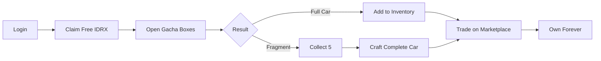

# 🚗 Welcome to MiniGarage

## The Future of Digital Car Collecting

MiniGarage combines the **excitement of gacha mechanics** with the **security of blockchain ownership** to create the ultimate NFT car collection experience on Base.

---

## ⚡ Quick Start

<table data-card-size="large" data-view="cards"><thead><tr><th></th><th></th><th data-hidden data-card-target data-type="content-ref"></th></tr></thead><tbody><tr><td><strong>🎮 Try the Demo</strong></td><td>Experience MiniGarage live on Base Sepolia testnet</td><td><a href="getting-started/demo-and-links.md">demo-and-links.md</a></td></tr><tr><td><strong>🛠️ For Developers</strong></td><td>Set up locally and deploy your own instance</td><td><a href="project/local-setup.md">local-setup.md</a></td></tr><tr><td><strong>📚 Learn More</strong></td><td>Understand the problem we solve</td><td><a href="introduction/problem-solution.md">problem-solution.md</a></td></tr></tbody></table>

---

## 🎯 What is MiniGarage?

MiniGarage is an **NFT-based car collection platform** where users can:

### Core Actions

| Action | Description | Benefit |
|--------|-------------|---------|
| 🎰 **Roll Gacha** | Open boxes for random cars/fragments | Exciting RNG mechanics |
| 🧩 **Craft Cars** | Collect 5 fragments → 1 complete car | Guaranteed progression |
| 🏪 **Trade** | Buy/sell on peer-to-peer marketplace | Real value exchange |
| 💰 **Use IDRX** | Native token for all transactions | Gasless experience |
| 🔐 **Own Forever** | ERC-721 NFTs in your wallet | True ownership |

---

## 🚨 The Problem

*   **No True Ownership:** Gamers spend billions on in-game items locked in walled gardens, losing everything if servers shut down.
*   **Unverifiable Scarcity:** Digital "limited editions" are often arbitrary, with no guarantee that developers won't mint more.
*   **RWA Supply Mismatch:** Many projects oversell NFTs beyond their physical stock, leading to redemption failures.
*   **Inefficient Collecting:** Real-world collectors waste time hunting for inventory in physical stores without real-time transparency.
*   **Unfair RNG:** Pure gacha systems leave players with useless duplicates and no clear path to their desired item.
*   **Web3 Friction:** Mainstream users are discouraged by complex wallet setups and gas fees.

---

## ✅ Our Solution

MiniGarage bridges the gap between physical collecting and digital ownership through a transparent, fair, and accessible ecosystem:

### 1. Hard-Capped RWA Supply
We enforce a strict **1:1 limit**. Digital minting is directly tied to real-world inventory. When physical cars run out, the gacha and assembly mechanisms automatically disable.

### 2. Fair Progression (Gacha + Fragments)
A hybrid model combining **Gacha** thrills with **Fragment Assembly**. Bad luck is mitigated—accumulate fragments to guarantee crafting your dream car.

### 3. Seamless Onboarding
Powered by **Privy**, users login via email or socials with gas-sponsored transactions, making the blockchain interaction invisible.

### 4. Real-Time Transparency
Collectors know exactly how many units remain, eliminating the guesswork of physical hunting.

#### 🔮 Future Roadmap: ERC-6551 Integration
We plan to explore **Token Bound Accounts** to give each car its own unique identity and provenance layer, allowing vehicles to hold their own upgrade history and racing achievements.

---

## �️ Built on Base

<table data-card-size="large" data-view="cards"><thead><tr><th></th><th></th></tr></thead><tbody><tr><td><strong>⚡ Ultra-Low Fees</strong></td><td>$0.01 per transaction vs $15-50 on Ethereum</td></tr><tr><td><strong>🚀 Fast Finality</strong></td><td>2-second blocks for instant confirmations</td></tr><tr><td><strong>🔧 EVM Compatible</strong></td><td>100% Solidity support, existing tools work</td></tr><tr><td><strong>🏢 Coinbase Backed</strong></td><td>Institutional trust and onboarding pipeline</td></tr></tbody></table>

**Learn more:** [Why Base?](introduction/why-base.md)

---

## 📊 Tech Stack

| Layer | Technology |
|-------|-----------|
| **Frontend** | Next.js 15.5.9, React, TailwindCSS, PWA |
| **Blockchain** | Base Sepolia (testnet), Base Mainnet (planned) |
| **Smart Contracts** | Solidity 0.8.20, ERC-20, ERC-721 |
| **Authentication** | Privy embedded wallets |
| **Token** | MockIDRX (0x998f8B20...cA7847) |
| **Build Tools** | Hardhat, Ethers.js v6 |

---

## 🎯 MVP Features

### ✅ Completed (Current)

- [x] **Gacha System** - 4 tiers with probability-based drops
- [x] **Fragment Crafting** - Collect 5 → complete car
- [x] **P2P Marketplace** - Trade cars and fragments
- [x] **IDRX Integration** - Faucet, minting, burning
- [x] **Privy Auth** - Email/social login
- [x] **Inventory** - View your NFT collection
- [x] **Mobile PWA** - Installable web app

### 🔄 In Progress (Alpha)

- [ ] **Mainnet Deployment** - Migrate to Base mainnet
- [ ] **Achievement System** - Unlock rewards
- [ ] **Leaderboards** - Compete with friends

### 📅 Planned (Beta)

- [ ] **Physical Redemption** - NFT → real diecast car
- [ ] **Staking** - Earn IDRX from holdings
- [ ] **Tournaments** - Limited-time events

---

## 🎮 For Players

<table data-card-size="large" data-view="cards"><thead><tr><th></th><th></th><th data-hidden data-card-target data-type="content-ref"></th></tr></thead><tbody><tr><td><strong>🚀 Get Started</strong></td><td>5-minute quickstart guide</td><td><a href="getting-started/demo-and-links.md">demo-and-links.md</a></td></tr><tr><td><strong>🎰 How Gacha Works</strong></td><td>Understand the mechanics</td><td><a href="getting-started/user-flow.md">user-flow.md</a></td></tr><tr><td><strong>❓ FAQ</strong></td><td>Common questions answered</td><td><a href="resources/faq.md">faq.md</a></td></tr></tbody></table>

---

## 👨‍💻 For Developers

<table data-card-size="large" data-view="cards"><thead><tr><th></th><th></th><th data-hidden data-card-target data-type="content-ref"></th></tr></thead><tbody><tr><td><strong>🛠️ Local Setup</strong></td><td>Run MiniGarage locally</td><td><a href="project/local-setup.md">local-setup.md</a></td></tr><tr><td><strong>📜 Smart Contracts</strong></td><td>Contract architecture</td><td><a href="technical/smart-contracts.md">smart-contracts.md</a></td></tr><tr><td><strong>🏗️ Architecture</strong></td><td>System design overview</td><td><a href="technical/architecture.md">architecture.md</a></td></tr></tbody></table>

---

## 🌟 Why MiniGarage?

### For Users

| Benefit | Explanation |
|---------|-------------|
| 🎯 **Easy to Start** | Login with email, no crypto knowledge needed |
| 🎰 **Fun Mechanics** | Gacha excitement + guaranteed progression |
| 💎 **Real Ownership** | Your NFTs, your wallet, forever |
| 💰 **Free to Try** | 100K IDRX airdrop on signup |

### For Developers

| Benefit | Explanation |
|---------|-------------|
| 🧩 **Modular Design** | Clean separation: contracts, API, frontend |
| 📚 **Well Documented** | Comprehensive guides and comments |
| 🔧 **Modern Stack** | Next.js 15, React Server Components |
| 🚀 **Production Ready** | Security focused, gas optimized |

---


**Ready to collect your first NFT car?**

Get started in less than 5 minutes with our [Demo & Links Guide](getting-started/demo-and-links.md) →


---

## 📖 Documentation Structure

Explore the full documentation:

* 💡 [Introduction](introduction/)
  * [Problem & Solution](introduction/problem-solution.md)
  * [Why Base?](introduction/why-base.md)
  * [Key Features](introduction/key-features.md)
* 🚀 [Getting Started](getting-started/)
  * [Demo & Links](getting-started/demo-and-links.md)
  * [User Flow](getting-started/user-flow.md)
  * [Deployment Info](getting-started/deployment-on-base.md)
* 🏗️ [Technical Architecture](technical/)
  * [System Architecture](technical/architecture.md)
  * [Smart Contracts](technical/smart-contracts.md)
  * [IDRX Integration](technical/idrx-integration.md)
* 📋 [Project Info](project/)
  * [Roadmap](project/roadmap.md)
  * [Team](project/team.md)
  * [Local Setup](project/local-setup.md)
* 📚 [Resources](resources/)
  * [FAQ](resources/faq.md)
