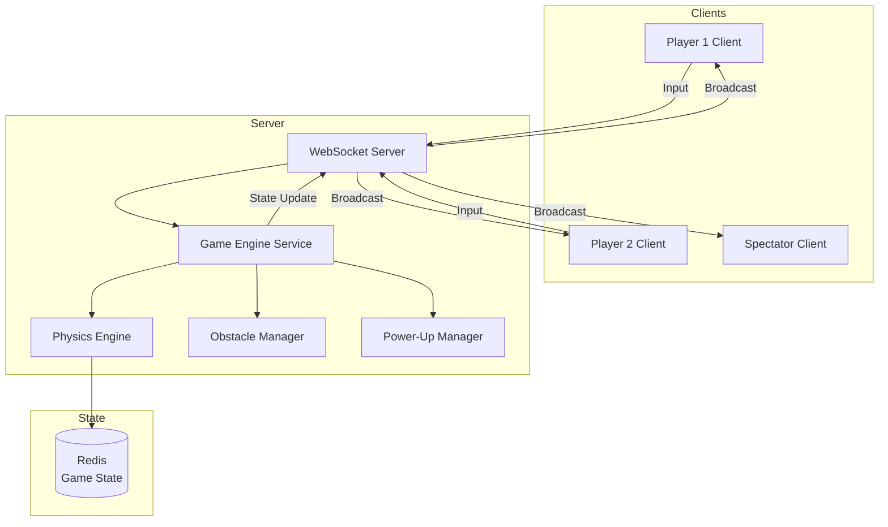
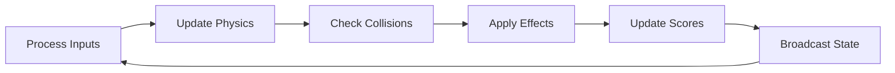
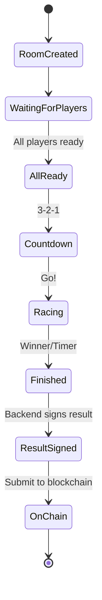

# Game Engine

MiniGarage uses a **server-authoritative game engine** to ensure fair and cheat-proof racing.

## Architecture



## Physics Engine

The physics engine runs at **60 FPS** on the server:

### Movement
* Position updates based on Speed stat and acceleration curve
* Lane-based movement (3 lanes in Endless mode)
* Smooth interpolation for client-side rendering

### Collision Detection
* Obstacle collision → HP reduction
* Power-up collection → Apply effect
* Player-to-player proximity in multiplayer

### State Update Cycle



Each tick (16.67ms at 60 FPS):
1. **Process Inputs** — Read queued player inputs from WebSocket
2. **Update Physics** — Calculate new positions, speeds, accelerations
3. **Check Collisions** — Detect obstacle hits and power-up collections
4. **Apply Effects** — Speed boosts, shields, score multipliers
5. **Update Scores** — Distance, obstacles dodged, game time
6. **Broadcast State** — Send updated state to all connected clients

## Endless Race Engine

The Endless Race mode has additional systems:

### Obstacle Generation
* Procedurally generated obstacles at increasing frequency
* Multiple obstacle types with different sizes and patterns
* Difficulty scales with distance traveled

### Power-Up System

| Power-Up | Effect | Duration |
|----------|--------|----------|
| Speed Boost | +50% speed | 5 seconds |
| Shield | Absorb 1 hit | Until used |
| Score Multiplier | 2x points | 8 seconds |

### Scoring Formula
```
Score = Distance × SpeedMultiplier + ObstaclesDodged × 10
```

## Game Engine Service

The `GameEngineService` manages the lifecycle of all active game sessions:



## Anti-Cheat

| Measure | How It Works |
|---------|-------------|
| **Server authority** | Client cannot modify game state |
| **Input validation** | Only valid inputs accepted (lane change, accelerate) |
| **State broadcasting** | All clients receive the same authoritative state |
| **Signed results** | Race results are Ed25519-signed before on-chain submission |
| **Tick rate** | 60 FPS server simulation prevents timing exploits |
