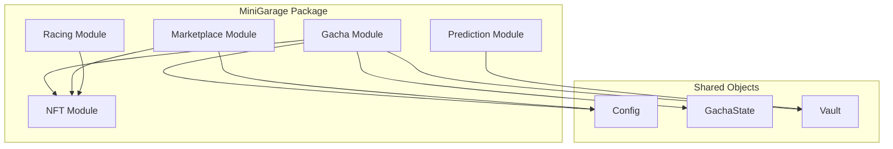
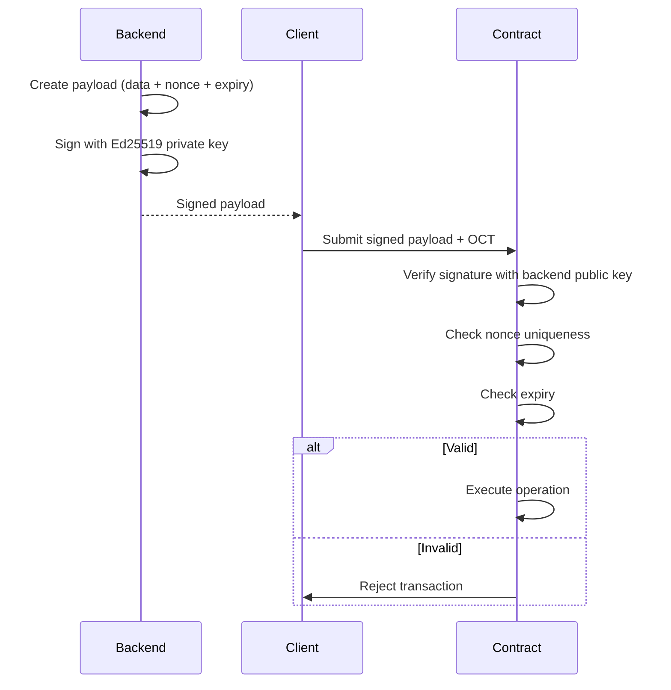

# Smart Contracts

MiniGarage smart contracts are written in **Move** and deployed on OneChain (Sui-based).

## Contract Architecture

## Modules

### NFT Module
* Defines `Car` and `SparePart` NFT types
* Minting, transferring, and burning functions
* Equipment system (equip/unequip parts to cars)
* Brand and rarity metadata

### Gacha Module
* Commit-reveal pattern for fair randomness
* Tier-based pricing with backend signature verification
* NFT minting on successful reveal
* Anti-replay protection via nonce tracking

### Marketplace Module
* List NFTs for sale (escrow in contract)
* Buy listed NFTs (OCT payment)
* Cancel listings (return NFT to seller)
* Fee collection (marketplace fee + royalty)

### Racing Module
* Room creation with backend signature
* Player approval and entry fee collection
* Race result finalization with signed proof
* Prize pool distribution

### Prediction Module
* Prediction pool creation per race
* Bet placement with OCT tokens
* Settlement with backend-signed winner
* Proportional payout calculation and claiming

## Signature Verification

All critical operations require **Ed25519 signatures** from the backend:

This ensures:
* Only the backend can authorize operations (no forged requests)
* Each signature is single-use (anti-replay via nonce)
* Signatures expire (time-limited validity)

## Shared Objects

| Object | Purpose |
|--------|---------|
| **Config** | Global configuration (fees, backend public key) |
| **GachaState** | Gacha tier prices, active status |
| **Vault** | Treasury for collected fees and OCT |
