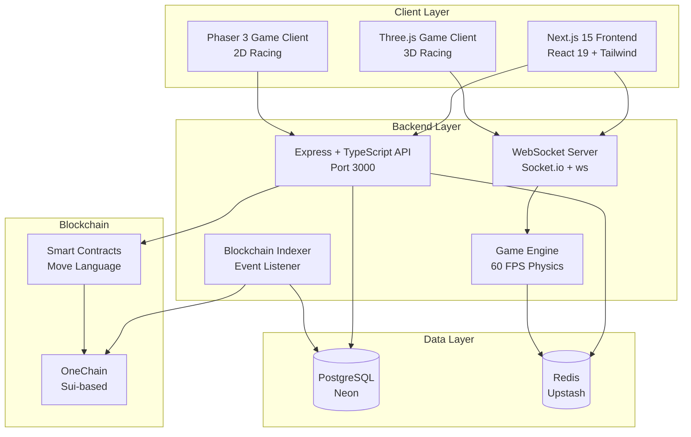
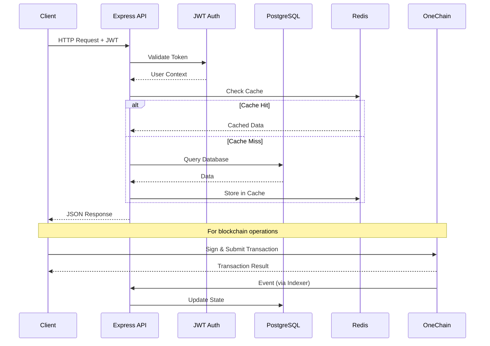
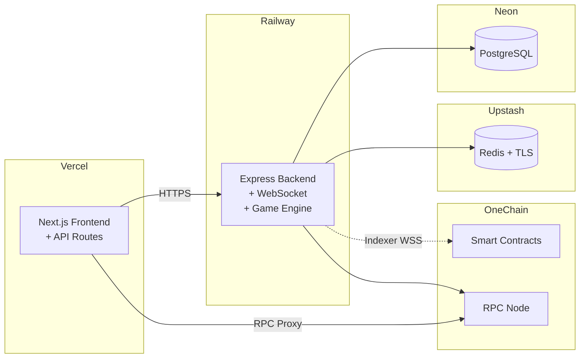

# System Overview

MiniLabs is composed of three main components: a **Next.js frontend**, an **Express backend**, and **smart contracts on OneChain**.

## High-Level Architecture

## Request Flow

## Component Responsibilities

| Component | Responsibility |
|-----------|---------------|
| **Frontend** | UI rendering, wallet integration, game display |
| **API Server** | Authentication, business logic, data access |
| **WebSocket** | Real-time game state during races |
| **Game Engine** | Server-authoritative physics simulation |
| **Indexer** | Listen for on-chain events, sync to database |
| **PostgreSQL** | Persistent storage for users, NFTs, races, quests |
| **Redis** | Game state cache, session management, rate limiting |
| **Smart Contracts** | NFT minting, marketplace, gacha, predictions |

## Deployment Architecture

