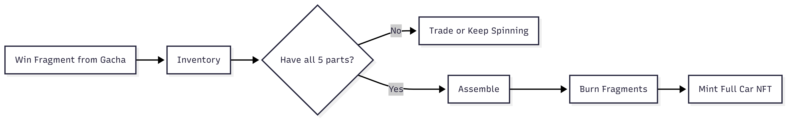

# 🧩 Fragment Assembly

Fragments are the progression layer of MiniGarage.  
If Gacha is about excitement, **Fragments are about certainty**.

---

## 🔄 From Gacha to Progress

Most Gacha spins reward **Fragments** instead of complete cars.

This is intentional.

Fragments ensure that:
- Every spin has value
- No unlucky player is left behind
- Progress toward a full car is always visible

> Gacha decides **how fast** you progress, not **if** you progress.

---

## 🧠 What Is a Fragment?

A **Fragment** represents a real car component.

Each fragment is:
- On-chain asset
- Tradeable with other players
- Required to assemble a complete car

### Fragment Types

To build a full car, you need **5 different fragments**:

<table data-card-size="large" data-view="cards">
<thead><tr><th>Fragment</th><th>Description</th><th>Fragment ID</th></tr></thead>
<tbody>
<tr>
<td><strong>Chassis</strong></td>
<td>Main structural frame</td>
<td>0</td>
</tr>
<tr>
<td><strong>Wheels</strong></td>
<td>Rolling system</td>
<td>1</td>
</tr>
<tr>
<td><strong>Engine</strong></td>
<td>Power unit</td>
<td>2</td>
</tr>
<tr>
<td><strong>Body</strong></td>
<td>Exterior shell</td>
<td>3</td>
</tr>
<tr>
<td><strong>Interior</strong></td>
<td>Cabin & details</td>
<td>4</td>
</tr>
</tbody>
</table>

---

## 🔢 The Assembly Rule

To assemble a complete car:

- You must own **all 5 fragment types**
- All fragments must belong to:
  - The **same car model**
  - The **same rarity tier**

❌ Mixing different models or tiers is not allowed.

---

## 🔄 Assembly Flow

⚡ Gasless Crafting
Fragment assembly is completely gasless.

Users sign a permission to burn fragments

Backend relays the transaction

Gas fees are paid by the platform

The full Car NFT is minted on-chain

Users never need ETH to craft cars.

🎯 Rarity Preservation
Fragment rarity is preserved during assembly.

Fragment Tier	Crafted Car
Common	Common Car
Rare	Rare Car
Epic	Epic Car
Legendary	Legendary Car
A Legendary car can only be crafted from Legendary fragments.

🧠 Why This Matters
Fragments solve the biggest problem in gacha games:

Traditional Gacha
Endless bad luck

No visible progress

High frustration

MiniGarage
Every spin adds progress

Clear goal to work toward

Guaranteed reward with enough effort

Luck influences speed — not outcome.

📝 On-Chain Enforcement
Fragment logic is enforced by smart contracts.

Fragments use ERC-1155

Cars use ERC-721

Fragments are burned permanently during assembly

Car NFTs are minted only after a valid burn

function burnForAssembly(
    address user,
    uint256[] memory ids,
    uint256[] memory amounts
) external onlyMinter;
🔁 Progression Loop Summary
Gacha → Fragment → Trade → Assemble → Full Car NFT
Fragments turn randomness into progression.

➡️ What’s Next?
After assembling a full car, players can:

Keep it as a digital collectible

Trade it on the marketplace

(Roadmap) Redeem it for a physical car

Continue to Marketplace to see how players trade fragments and cars.