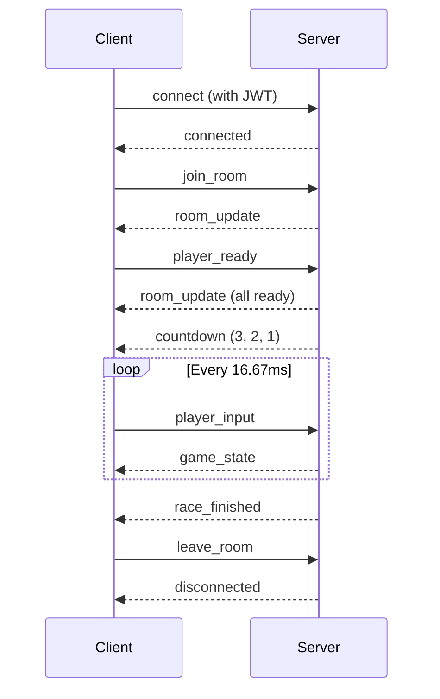

# WebSocket Events

MiniLabs uses **Socket.io** for real-time game communication during multiplayer races.

## Connection

```javascript
const socket = io("wss://minilabs-backend.up.railway.app", {
  auth: { token: "jwt..." }
});
```

## Client → Server Events

### `join_room`
Join a game room.
```json
{ "roomId": "room-uid", "carUid": "car-uid" }
```

### `player_ready`
Signal that player is ready to race.
```json
{ "roomId": "room-uid" }
```

### `player_input`
Send player input during race.
```json
{
  "roomId": "room-uid",
  "input": {
    "lane": 1,
    "accelerate": true,
    "timestamp": 1711468800000
  }
}
```

### `leave_room`
Leave the current room.
```json
{ "roomId": "room-uid" }
```

### `spectate`
Join as a spectator.
```json
{ "roomId": "room-uid" }
```

---

## Server → Client Events

### `room_update`
Room status changed (player joined, left, ready).
```json
{
  "roomId": "room-uid",
  "status": "WAITING",
  "players": [
    { "address": "0x...", "carUid": "...", "isReady": true }
  ]
}
```

### `countdown`
Race is about to start.
```json
{ "count": 3 }
```

### `game_state`
Authoritative game state update (broadcast every tick).
```json
{
  "tick": 1234,
  "players": {
    "0x...": {
      "position": 245.5,
      "speed": 120,
      "lane": 1,
      "hp": 100,
      "score": 5000,
      "obstaclesHit": 2,
      "powerUpsCollected": 3
    }
  },
  "obstacles": [...],
  "powerUps": [...]
}
```

### `race_finished`
Race has ended.
```json
{
  "roomId": "room-uid",
  "winner": "0x...",
  "rankings": [
    {
      "address": "0x...",
      "position": 1,
      "finishTime": "12345",
      "score": 15000,
      "obstaclesHit": 2,
      "powerUpsCollected": 5
    }
  ],
  "signature": "0x...",
  "message": "0x..."
}
```

### `player_eliminated`
A player has been eliminated (HP reached 0).
```json
{ "address": "0x...", "reason": "obstacle_collision" }
```

### `error`
Server-side error.
```json
{ "code": "ROOM_FULL", "message": "Room is already full" }
```

---

## Connection Lifecycle


