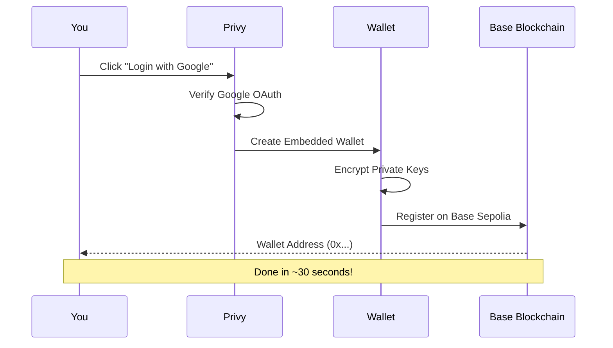
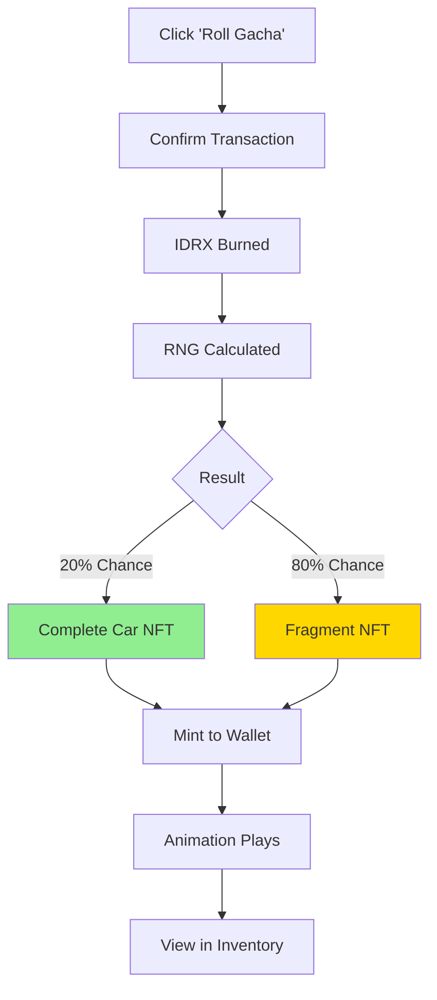

# 🚀 Quick Start Guide

Get started with MiniGarage in **less than 5 minutes** - no crypto experience required!

***

## Overview

This guide will walk you through:

1. ✅ Creating your account (30 seconds)
2. ✅ Claiming free IDRX tokens (1 minute)
3. ✅ Opening your first gacha box (2 minutes)
4. ✅ Viewing your NFT collection (1 minute)

**Total time: \~5 minutes** ⏱️

***

## Step 1: Access MiniGarage

### Live Demo

🔗 **Testnet App:** [https://minigarage-demo.vercel.app](https://minigarage-demo.vercel.app)


**Network:** Base Sepolia Testnet\
**No real money involved** - this is a free testnet demo!


***

## Step 2: Create Your Account

### Choose Your Login Method

MiniGarage supports **4 login options**:

<table data-card-size="large" data-view="cards"><thead><tr><th></th><th></th></tr></thead><tbody><tr><td><strong>📧 Email</strong></td><td>Receive One Time Password, click to login</td></tr><tr><td><strong>🌐 Google</strong></td><td>One-click OAuth login</td></tr><tr><td><strong>🐦 Twitter</strong></td><td>Connect with X account</td></tr><tr><td><strong>💬 Discord</strong></td><td>Login via Discord</td></tr></tbody></table>

### What Happens Behind the Scenes

**Result:** You now have a Base Sepolia wallet address! 🎉

***

## Step 3: Claim Free IDRX

### Get Your Starting Tokens

1. **Navigate to Dashboard**
   * After login, you'll see your balance: `0 IDRX`
2. **Click "Claim Faucet"**
   * Opens faucet modal
   * Shows available: `100,000 IDRX` (first-time bonus)
3. **Confirm Claim**
   * Transaction processed (backend sponsors gas)
   * Wait 2-3 seconds for confirmation
   * Balance updates to `100,000 IDRX` ✅


**First-Time Bonus:** 100,000 IDRX (enough for 4 gacha rolls!)\
**Daily Faucet:** Come back every 24 hours for 25,000 IDRX


### IDRX Explained

| What           | Details                                       |
| -------------- | --------------------------------------------- |
| **Full Name**  | Mock Indonesian Rupiah (testnet token)        |
| **Contract**   | 0x998f8B20397445C10c1B60DCa1EebFbda4cA7847    |
| **Type**       | ERC-20 token on Base Sepolia                  |
| **Purpose**    | In-game currency for gacha, trading, crafting |
| **Real Value** | None (testnet only)                           |

***

## Step 4: Open Your First Gacha

### Choose Your Tier

Navigate to **"Gacha"** page and select a tier:

<table data-card-size="large" data-view="cards"><thead><tr><th></th><th></th><th></th></tr></thead><tbody><tr><td><strong>🥉 Common</strong></td><td>Cost: 25K IDRX</td><td>50% drop rate</td></tr><tr><td><strong>🥈 Rare</strong></td><td>Cost: 25K IDRX</td><td>30% drop rate</td></tr><tr><td><strong>🥇 Epic</strong></td><td>Cost: 25K IDRX</td><td>15% drop rate</td></tr><tr><td><strong>💎 Legendary</strong></td><td>Cost: 25K IDRX</td><td>5% drop rate</td></tr></tbody></table>


⚠️ **You Need Small Amount Base Sepolia For Approve Transaction**

Get Base Sepolia ETH from: https://faucet.base.org



**Pro Tip:** All tiers cost the same (25K IDRX). Higher tiers have lower drop rates but more valuable rewards!


### The Gacha Flow

### What You Get

**Option 1: Complete Car (20% chance)**

* ✅ Full car NFT minted to your wallet
* ✅ Can be traded immediately
* ✅ Viewable in inventory
* ✅ On-chain ownership forever

**Option 2: Fragment (80% chance)**

* ✅ Fragment NFT minted to your wallet
* ✅ Collect 5 same-tier fragments
* ✅ Craft into complete car
* ✅ Trade fragments on marketplace

***

## Step 5: View Your Collection

### Inventory Page

Navigate to **"Inventory"** to see your NFTs:

**Tabs:**

* 🚗 **Cars** - Complete car NFTs
* 🧩 **Fragments** - Fragment NFTs

**Filters:**

* All Tiers
* Common
* Rare
* Epic
* Legendary

### NFT Details

Each NFT shows:

* **Image** - Visual representation
* **Name** - Car model name
* **Tier** - Rarity level
* **Token ID** - Unique identifier
* **Actions** - Trade, sell, or craft

***

## Step 6: Explore More Features

### 🏪 Marketplace

Buy/sell NFTs from other players:

* Browse listings
* Filter by tier/type
* Purchase with IDRX
* List your own NFTs

### 🧩 Fragment Crafting

Assemble complete cars:

1. Collect 5 same-tier fragments
2. Navigate to fragment page
3. Click "Craft Car"
4. Burn 5 fragments → mint 1 car

### 📊 Transaction History

Track all your activities:

* Gacha rolls
* Marketplace trades
* Fragment crafts
* IDRX claims

***

## 🎯 Your First Session Goals

Complete these milestones:

* [ ] ✅ Create account (30 sec)
* [ ] ✅ Claim 100K IDRX (1 min)
* [ ] ✅ Open 1 gacha box (2 min)
* [ ] ✅ View NFT in inventory (1 min)
* [ ] ✅ Open 3 more boxes (5 min)
* [ ] ✅ List NFT on marketplace (optional)

**Estimated time:** 5-10 minutes

***

## 🆘 Troubleshooting

### I can't login

**Solution:**

* Check internet connection
* Try different login method (email vs Google)
* Clear browser cache
* Try incognito mode

### I don't see my IDRX

**Solution:**

* Wait 5-10 seconds for transaction confirmation
* Refresh the page
* Check Base Sepolia explorer: [https://sepolia.basescan.org](https://sepolia.basescan.org)

### Gacha animation is stuck

**Solution:**

* Wait 10-15 seconds (blockchain confirmation time)
* Check transaction on BaseScan
* Refresh page to see NFT in inventory

### I got a fragment, not a car

**Solution:**

* This is normal! 80% chance for fragments
* Collect 5 same-tier fragments to craft a complete car
* Or trade fragments on marketplace

***

## 📱 Mobile Installation (PWA)

### iOS (Safari)

1. Open MiniGarage in Safari
2. Tap **Share** button (box with arrow)
3. Scroll and tap **"Add to Home Screen"**
4. Tap **"Add"**
5. Icon appears on home screen ✅

### Android (Chrome)

1. Open MiniGarage in Chrome
2. Tap **menu** (3 dots)
3. Tap **"Add to Home Screen"**
4. Tap **"Add"**
5. Icon appears on home screen ✅

**Benefits:**

* Launches like native app
* Faster load times
* Offline-ready (cached assets)
* No app store required

***

## 🎓 Next Steps

### Learn More

<table data-card-size="large" data-view="cards"><thead><tr><th></th><th></th><th data-hidden data-card-target data-type="content-ref"></th></tr></thead><tbody><tr><td><strong>🎰 How Gacha Works</strong></td><td>Deep dive into mechanics</td><td><a href="user-flow.md">user-flow.md</a></td></tr><tr><td><strong>🧩 Fragment System</strong></td><td>Crafting strategy guide</td><td><a href="../introduction/key-features.md">key-features.md</a></td></tr><tr><td><strong>❓ FAQ</strong></td><td>Common questions</td><td><a href="../resources/faq.md">faq.md</a></td></tr></tbody></table>

### Join the Community

* 📧 Email: minigarage@example.com
* 🐦 Twitter: @minigarage\_nft
* 💬 Discord: discord.gg/minigarage

***


**Congratulations!** 🎉

You've completed the quick start guide. You now have:

* ✅ A Base Sepolia wallet
* ✅ Free IDRX tokens
* ✅ Your first NFT car/fragment
* ✅ Understanding of core mechanics

**Ready to collect more?** Keep rolling and building your collection! 🚗💨


***

## 🔗 Useful Links

| Resource                  | URL                                |
| ------------------------- | ---------------------------------- |
| **Live Demo**             | https://minigarage-demo.vercel.app |
| **GitHub**                | https://github.com/minigarage      |
| **Base Sepolia Explorer** | https://sepolia.basescan.org       |
| **Base Faucet**           | https://faucet.base.org            |
| **IDRX Contract**         | 0x998f8B20...cA7847                |
