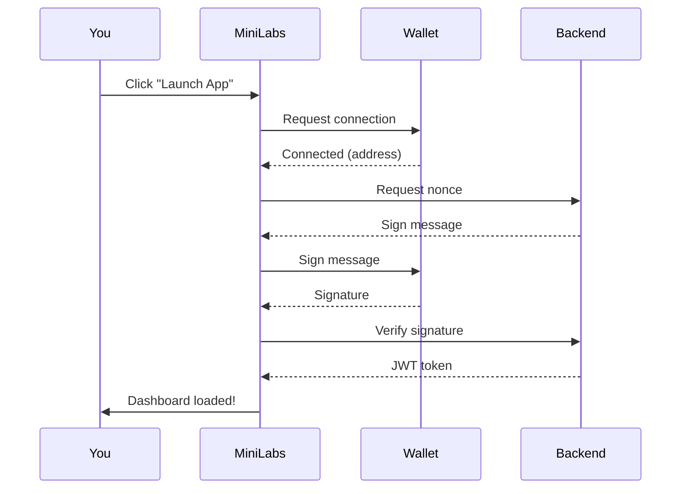

# Getting Started

Get up and running with MiniLabs in under 2 minutes.

## Step 1 — Install a Wallet

MiniLabs runs on **OneChain** (a Sui-based blockchain). You'll need a compatible wallet:

* Install a OneChain-compatible wallet extension
* Create a new wallet or import an existing one
* Make sure you have some **OCT tokens** for transactions

## Step 2 — Connect Your Wallet

1. Visit [MiniLabs App](https://minilabsapp.vercel.app)
2. Tap **Launch App** on the landing page
3. Your wallet extension will prompt you to connect
4. Approve the connection

## Step 3 — Authenticate

After connecting, MiniLabs authenticates you securely:

## Step 4 — Explore the Dashboard

Once authenticated, you'll see:

* **OCT Balance** — Your token balance on OneChain
* **Your Cars** — NFT cars in your collection
* **Gacha** — Pull boxes to get new cars
* **Quick Actions** — Play Game, Marketplace, Quests

## Step 5 — Pull Your First Gacha

1. Navigate to **Gacha** from the dashboard
2. Choose the **Economy** tier (cheapest)
3. Confirm the OCT payment
4. Wait for the commit-reveal process
5. Discover your new NFT car or spare part!

## Step 6 — Start Racing

1. Go to **Game** from the bottom navigation
2. Select a car from your collection
3. Choose a game mode (Drag Race, Endless, or Multiplayer)
4. Race and earn rewards!

---

> **Tip:** Complete the onboarding tutorial on your first visit — it walks you through all features step by step.
