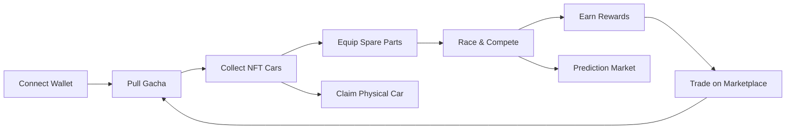

# What is MiniGarage?

MiniGarage is a **play-to-earn NFT car racing game** built on OneChain. It combines the thrill of competitive racing with the ownership economy of blockchain — every car you collect is a true digital asset that you own, trade, and upgrade.

## The Vision

MiniGarage bridges gaming and Web3 by making blockchain interactions seamless. Players don't need to understand smart contracts — they just play, collect, and compete. Under the hood, every car, trade, and race result is secured on-chain.

## Core Pillars

### Collect
Pull gacha boxes to discover rare NFT cars with unique performance stats. Each car has Speed, Acceleration, Handling, and Drift attributes that directly impact race performance.

### Race
Compete in multiple game modes — from quick 2D drag races to intense 3D endless runs and multiplayer battles. Your car's stats and equipped spare parts determine your edge.

### Trade
A fully on-chain marketplace lets you buy, sell, and discover NFT cars and spare parts. Set your price, list your assets, and build the ultimate collection.

### Earn
Complete daily quests, win races, predict outcomes, and trade strategically to earn OCT tokens and grow your garage.

### Own
Legendary NFT cars can be redeemed for **physical diecast models** — bridging digital and real-world ownership through Real-World Assets (RWA).

---

## How It All Connects

