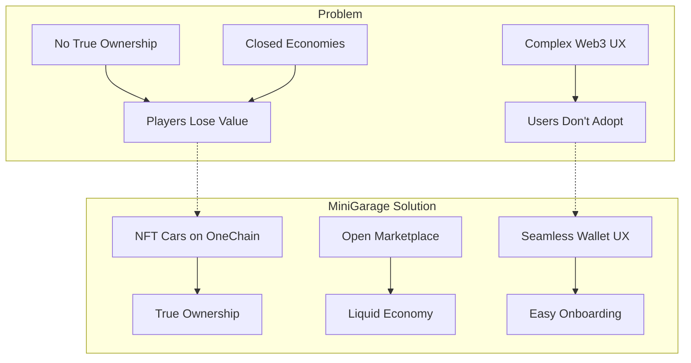

# Problem & Solution

## The Problem

Traditional gaming has fundamental ownership issues:

| Problem | Impact |
|---------|--------|
| **No true ownership** | Players spend money on in-game items they never truly own |
| **Closed economies** | Items are locked inside a single game with no external value |
| **Centralized control** | Game publishers can change, nerf, or delete items at will |
| **No interoperability** | Assets from one game can't be used or traded elsewhere |
| **Pay-to-win fatigue** | Opaque loot box systems with no verifiable fairness |

Meanwhile, most Web3 games suffer from:

* **Poor gameplay** — blockchain-first, fun-second approach
* **Complex onboarding** — requiring users to manage wallets, gas, and bridges
* **Speculative focus** — more about token prices than actual gaming

---

## The Solution

MiniGarage solves both sides of the equation:

### For Gamers
* **Fun-first design** — engaging racing mechanics across multiple game modes
* **Seamless Web3** — wallet connection takes seconds, blockchain is invisible during gameplay
* **Real ownership** — every car and spare part is an NFT you truly own
* **Earn while playing** — quests, races, and predictions all generate real value

### For Collectors
* **Verifiable scarcity** — rarity tiers enforced by smart contracts
* **Open marketplace** — trade freely with transparent on-chain pricing
* **Physical rewards** — legendary cars can be claimed as real diecast models (RWA)

### For the Ecosystem
* **Commit-reveal gacha** — cryptographically fair randomness, no server manipulation
* **Server-authoritative racing** — cheat-proof game engine running at 60 FPS
* **On-chain settlement** — race results, trades, and predictions all finalized on-chain

---

