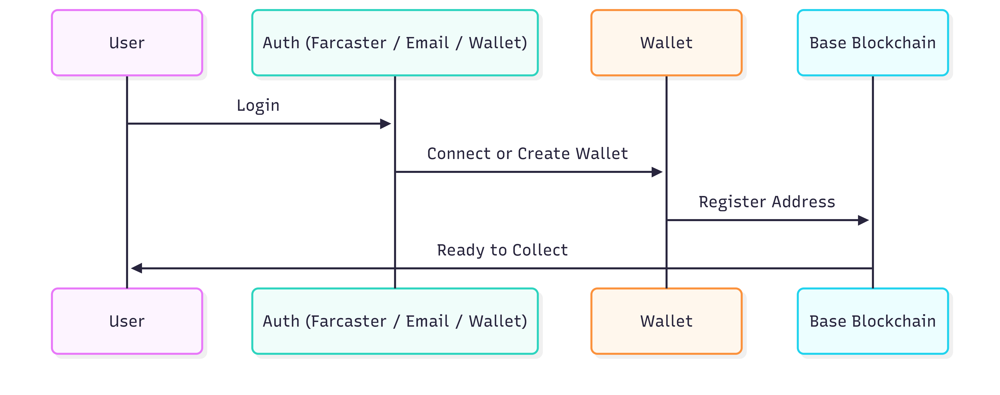

# Problem & Solution

## 🚨 The Problem

Traditional digital collectibles, gacha systems, and real-world collecting suffer from **key structural flaws** that prevent true ownership, fairness, and long-term value.

---

### 1. No True Ownership

<table data-card-size="large" data-view="cards">
<thead><tr><th></th><th></th></tr></thead>
<tbody>
<tr>
<td><strong>❌ Traditional Games</strong></td>
<td>You spend money on in-game items, but the game company owns everything. When the game shuts down, you lose it all.</td>
</tr>
<tr>
<td><strong>✅ MiniGarage</strong></td>
<td>Every car is issued as an NFT that you truly own. Even if the platform shuts down, your assets remain on-chain.</td>
</tr>
</tbody>
</table>

**Example:**  
> A player spends \$500 on rare car skins in a mobile game.  
> The game shuts down.  
> **Result:** All items are lost, with no refund or transferability.

---

### 2. Complex Web3 Onboarding

<table data-card-size="large" data-view="cards">
<thead><tr><th></th><th></th></tr></thead>
<tbody>
<tr>
<td><strong>❌ Most Web3 Apps</strong></td>
<td>
Require users to:
 • Install browser wallets
 • Secure seed phrases
 • Buy ETH for gas
 • Understand blockchain concepts
</td>
</tr>
<tr>
<td><strong>✅ MiniGarage</strong></td>
<td>
Login using:
 • Farcaster
 • Email
 • External Wallet
  No complex setup required.
</td>
</tr>
</tbody>
</table>

**Reality:**
- Most mainstream users abandon Web3 apps during wallet setup  
- MiniGarage removes this friction with familiar login methods  

---

### 3. No Fair & Transparent Supply Control for RWA

Most gacha and digital collectible systems suffer from:

- **Infinite minting** — supply can be increased at will  
- **Unverifiable scarcity** — “limited” items keep reappearing  
- **Broken RWA claims** — NFTs exceed real-world asset availability  

This leads to:
- Loss of trust  
- Oversupply  
- Broken economies  

<table data-card-size="large" data-view="cards">
<thead><tr><th></th><th></th></tr></thead>
<tbody>
<tr>
<td><strong>❌ Traditional Gacha</strong></td>
<td>Items can be minted endlessly, even if marketed as rare.</td>
</tr>
<tr>
<td><strong>✅ MiniGarage</strong></td>
<td>
NFT minting is <strong>hard-capped</strong> by real-world asset supply.  
If only 1,000 physical items exist, only 1,000 NFTs can ever be minted.
</td>
</tr>
</tbody>
</table>

---

### 4. Pure RNG Gacha Is Unfair

Traditional gacha systems rely entirely on luck:

- Two users can spend the same amount  
- One gets a rare item, the other gets nothing  
- There is no guaranteed progress  

This creates frustration and discourages long-term collectors.

---

### 5. Physical Collecting Is Inefficient

Real-world collectors often:

- Visit multiple physical stores  
- Spend time and travel costs  
- Arrive only to find items already sold out  

There is no real-time visibility into remaining supply, leading to wasted effort and unfair access.

---

## ✅ Our Solution

MiniGarage addresses these problems through a system designed for **ownership, fairness, and real-world-backed scarcity**.

---

### 1. True Digital Ownership via NFTs

**Key Benefits:**
*   Permanent ownership.
*   Fully transferable assets.
*   Independent of platform availability.

---

### 2. Seamless Web2-Style Onboarding

Users interact with blockchain without needing to understand crypto mechanics.

---

### 3. Gas-Abstracted User Experience

All core actions are gas-abstracted using IDRX or sponsored transactions.

<table data-card-size="large" data-view="cards">
<thead><tr><th></th><th></th><th></th></tr></thead>
<tbody>
<tr>
<td><strong>Action</strong></td>
<td><strong>Traditional Web3</strong></td>
<td><strong>MiniGarage</strong></td>
</tr>
<tr>
<td>Open Gacha</td>
<td>ETH + Gas</td>
<td>✅ <strong>Gasless</strong></td>
</tr>
<tr>
<td>Mint NFT</td>
<td>User Pays Gas</td>
<td>✅ <strong>Sponsored</strong></td>
</tr>
<tr>
<td>Trade NFT</td>
<td>Gas Required</td>
<td>✅ <strong>Gasless</strong></td>
</tr>
<tr>
<td>Assemble Fragments</td>
<td>Gas Required</td>
<td>✅ <strong>Gasless</strong></td>
</tr>
<tr>
<td>Redeem Physical</td>
<td>Gas Required</td>
<td>✅ <strong>Sponsored</strong></td>
</tr>
</tbody>
</table>

Users never deal with failed transactions or unpredictable fees.

---

### 4. Gacha + Fragment Crafting (Fair Progression)

**Why It Matters:**
*   Every action has value.
*   RNG frustration is reduced.
*   Progress is guaranteed over time.

<table data-card-size="large" data-view="cards">
<thead><tr><th></th><th></th></tr></thead>
<tbody>
<tr>
<td><strong>Traditional Gacha</strong></td>
<td>Open Box → Random Result → Often Nothing</td>
</tr>
<tr>
<td><strong>MiniGarage</strong></td>
<td>
Open Box → Fragment 
Fragment → Progress 
Enough Fragments → <strong>Guaranteed Car</strong>
</td>
</tr>
</tbody>
</table>

---

### 5. Hard Supply Caps Tied to Real-World Assets (RWA)

Each car NFT represents a limited physical collectible.

*   NFT minting is **strictly capped** by physical supply.
*   When supply is exhausted, gacha and assembly are **disabled**.
*   Redemption requires **burning the NFT** on-chain.

Physical assets are custody-managed and can only be redeemed once, preventing double claims.

---

### 6. Peer-to-Peer Marketplace

Collectors can trade directly with each other:
*   No intermediaries.
*   Transparent price discovery.
*   On-chain ownership transfer.

Marketplace activity never affects total supply.

---

## 🔮 Future Roadmap: NFT Identity & Provenance

MiniGarage plans to adopt **ERC-6551** as a future enhancement.

This will allow each car NFT to carry:
*   Serial numbers.
*   Mint origin (gacha or assembly).
*   Redemption status.

ERC-6551 is not part of the current MVP, but strengthens long-term transparency and trust for real-world-backed collectibles.

---

## 🎯 Impact

<table data-card-size="large" data-view="cards">
<thead><tr><th></th><th></th></tr></thead>
<tbody>
<tr>
<td><strong>Before MiniGarage</strong></td>
<td>Spend → Hope → Lose Access → Zero Value</td>
</tr>
<tr>
<td><strong>With MiniGarage</strong></td>
<td>Login → Collect → Progress → Own → Trade or Redeem</td>
</tr>
</tbody>
</table>

**MiniGarage transforms:**
*   Spending into **ownership**.
*   RNG into **progression**.
*   Digital collectibles into **real-world-backed assets**.

---


MiniGarage combines accessibility, ownership, and physical value — without the usual Web3 friction.
