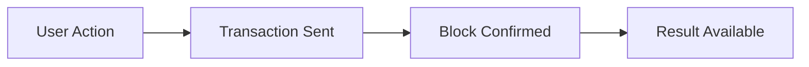
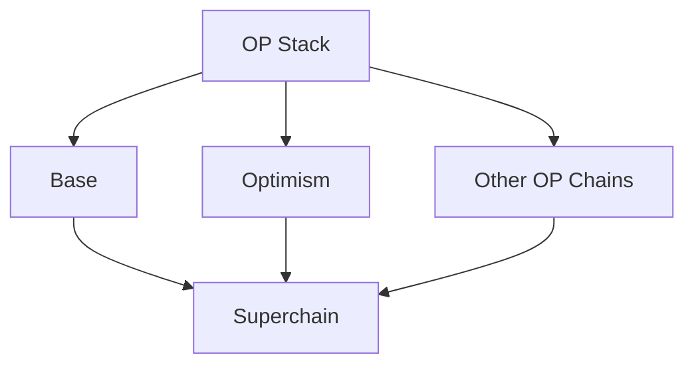
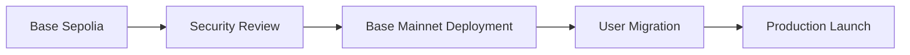

# Why Base?

## ⚡ Overview

MiniGarage is currently built on **Base Sepolia (testnet)** with a planned migration to **Base Mainnet**.  
Base is chosen because it provides the best balance between **cost efficiency, performance, developer experience, and user onboarding** for a consumer-focused NFT and gacha platform.

---

## 🔍 Selection Criteria

When selecting a blockchain for MiniGarage, we evaluated networks based on the following priorities:

| Criterion | Priority |
|:---|:---|
| Transaction Cost | High |
| Speed & Finality | High |
| Developer Experience | Medium |
| Ecosystem & Adoption | Medium |
| User Onboarding | High |

Base consistently ranked highest across these criteria.

---

## ✅ Why Base

### 1. Low and Predictable Transaction Costs

Frequent actions such as gacha rolls, fragment assembly, and NFT transfers require **low-cost transactions** to remain accessible.

<table data-card-size="large" data-view="cards">
<thead><tr><th></th><th></th></tr></thead>
<tbody>
<tr>
<td><strong>Ethereum Mainnet</strong></td>
<td>
<strong>High Cost & Friction</strong>  
• NFT Mint: $10 – $50 
• Transfer: $5 – $20 
• Gacha Roll: High Gas  
❌ <strong>Unsuitable for Consumer Apps</strong>
</td>
</tr>
<tr>
<td><strong>Base</strong></td>
<td>
<strong>Low Cost & Scalable</strong>  
• NFT Mint: $0.01 – $0.05 
• Transfer: &lt;$0.01 
• Gacha Roll: Negligible  
✅ <strong>Perfect for High Frequency</strong>
</td>
</tr>
</tbody>
</table>

**Example Scenario:**
*   **Ethereum L1:** High and unpredictable gas costs (unsuitable for repeated interactions).
*   **Base:** Orders of magnitude cheaper with consistent fees.

This cost structure enables MiniGarage to offer a gas-abstracted user experience without sacrificing decentralization.

---

### 2. Fast Finality for Better User Experience

Base offers fast block times (~2 seconds), which is well-suited for interactive consumer applications.

**Block Time Comparison:**

| Network | Approx. Block Time |
|:---|:---|
| Ethereum L1 | ~12–15 seconds |
| Polygon | ~2 seconds |
| **Base** | **~2 seconds** |
| Arbitrum | Sub-second batching |

For MiniGarage, Base provides fast-enough finality while maintaining a stable and widely adopted environment.

---

### 3. Full EVM Compatibility

Base is fully EVM-compatible, allowing MiniGarage to:
*   Use Solidity without modification.
*   Leverage standard tooling (Hardhat, Foundry, Ethers.js).
*   Apply established Ethereum security practices.
*   Maintain easy interoperability with Ethereum and other L2s.

This reduces development risk and speeds up iteration.

---

### 4. Strong Ecosystem and Institutional Backing

Base is developed and supported by Coinbase, which provides:
*   Trusted infrastructure.
*   A large existing user base.
*   Reliable developer tooling.
*   Long-term ecosystem commitment.

This backing makes Base particularly suitable for consumer-facing applications that require trust and reliability.

---

### 5. Consumer-Focused Ecosystem Growth

Base has become a popular L2 for consumer and social applications, including decentralized social platforms, NFT marketplaces, and consumer-focused DeFi.

This ecosystem alignment creates:
*   Easier user discovery.
*   Better liquidity for NFT trading.
*   Potential cross-application integrations.

MiniGarage is designed to grow alongside this ecosystem.

---

### 6. OP Stack and Long-Term Scalability

Base is built on the OP Stack, aligning it with the broader Optimism ecosystem and the Superchain vision.

**Benefits:**
*   Shared security model.
*   Lower costs through batching.
*   Future cross-chain interoperability.
*   Long-term scalability.

This ensures MiniGarage remains compatible with future network upgrades.

---

## 🆚 Base Compared to Alternatives

### Base vs Polygon

<table data-card-size="large" data-view="cards">
<thead><tr><th></th><th></th></tr></thead>
<tbody>
<tr>
<td><strong>Base</strong></td>
<td>
✅ <strong>Fees:</strong> Low & predictable 
✅ <strong>Backing:</strong> Coinbase (Trusted) 
✅ <strong>Focus:</strong> Consumer & Social
</td>
</tr>
<tr>
<td><strong>Polygon</strong></td>
<td>
✅ <strong>Fees:</strong> Low 
⚠️ <strong>Backing:</strong> Independent 
⚠️ <strong>Focus:</strong> Broad / General
</td>
</tr>
</tbody>
</table>

**Summary:** Base was chosen for its strong consumer focus and ecosystem momentum.

### Base vs Arbitrum

<table data-card-size="large" data-view="cards">
<thead><tr><th></th><th></th></tr></thead>
<tbody>
<tr>
<td><strong>Base</strong></td>
<td>
✅ <strong>Fees:</strong> Lower on average 
✅ <strong>UX Focus:</strong> Consumer-first 
✅ <strong>Integration:</strong> Native Coinbase
</td>
</tr>
<tr>
<td><strong>Arbitrum</strong></td>
<td>
⚠️ <strong>Fees:</strong> Slightly higher 
⚠️ <strong>UX Focus:</strong> DeFi-heavy 
❌ <strong>Integration:</strong> None
</td>
</tr>
</tbody>
</table>

**Summary:** Base better matches MiniGarage’s onboarding and UX goals.

### Base vs Ethereum L1

<table data-card-size="large" data-view="cards">
<thead><tr><th></th><th></th></tr></thead>
<tbody>
<tr>
<td><strong>Base</strong></td>
<td>
✅ <strong>Fees:</strong> $0.01 – $0.05 
✅ <strong>Speed:</strong> ~2s 
✅ <strong>Suitability:</strong> High for Gaming
</td>
</tr>
<tr>
<td><strong>Ethereum L1</strong></td>
<td>
❌ <strong>Fees:</strong> $5 – $50+ 
⚠️ <strong>Speed:</strong> ~12–15s 
❌ <strong>Suitability:</strong> Low for Gaming
</td>
</tr>
</tbody>
</table>

**Summary:** Base delivers Ethereum-level security with drastically lower cost and latency.

---

## 🚀 Deployment & Migration Strategy

**Current Status:**
*   Development and testing on Base Sepolia.
*   Mainnet deployment planned after security review and validation.

---

## 📊 Network Details

### Base Sepolia (Current)

<table data-card-size="large" data-view="cards">
<thead><tr><th></th><th></th></tr></thead>
<tbody>
<tr>
<td><strong>Chain ID</strong></td>
<td>84532</td>
</tr>
<tr>
<td><strong>RPC</strong></td>
<td>https://sepolia.base.org</td>
</tr>
<tr>
<td><strong>Explorer</strong></td>
<td>https://sepolia.basescan.org</td>
</tr>
<tr>
<td><strong>Block Time</strong></td>
<td>~2 seconds</td>
</tr>
</tbody>
</table>

### Base Mainnet (Target)

<table data-card-size="large" data-view="cards">
<thead><tr><th></th><th></th></tr></thead>
<tbody>
<tr>
<td><strong>Chain ID</strong></td>
<td>8453</td>
</tr>
<tr>
<td><strong>RPC</strong></td>
<td>https://mainnet.base.org</td>
</tr>
<tr>
<td><strong>Explorer</strong></td>
<td>https://basescan.org</td>
</tr>
<tr>
<td><strong>Block Time</strong></td>
<td>~2 seconds</td>
</tr>
</tbody>
</table>

---

## 🎯 Why Base Fits MiniGarage

<table data-card-size="large" data-view="cards">
<thead><tr><th></th><th></th></tr></thead>
<tbody>
<tr>
<td><strong>MiniGarage Needs</strong></td>
<td><strong>Base Capabilities</strong></td>
</tr>
<tr>
<td>Low-cost transactions</td>
<td>✅ Affordable L2 fees</td>
</tr>
<tr>
<td>Fast interactions</td>
<td>✅ Short block times</td>
</tr>
<tr>
<td>Easy onboarding</td>
<td>✅ Coinbase ecosystem</td>
</tr>
<tr>
<td>Developer velocity</td>
<td>✅ EVM compatibility</td>
</tr>
<tr>
<td>Future scalability</td>
<td>✅ OP Stack / Superchain</td>
</tr>
</tbody>
</table>


Base enables MiniGarage to focus on building a smooth collecting experience without exposing users to blockchain complexity.


---

## Next: Key Features

Learn how MiniGarage’s gacha, fragment system, and RWA mechanics work →