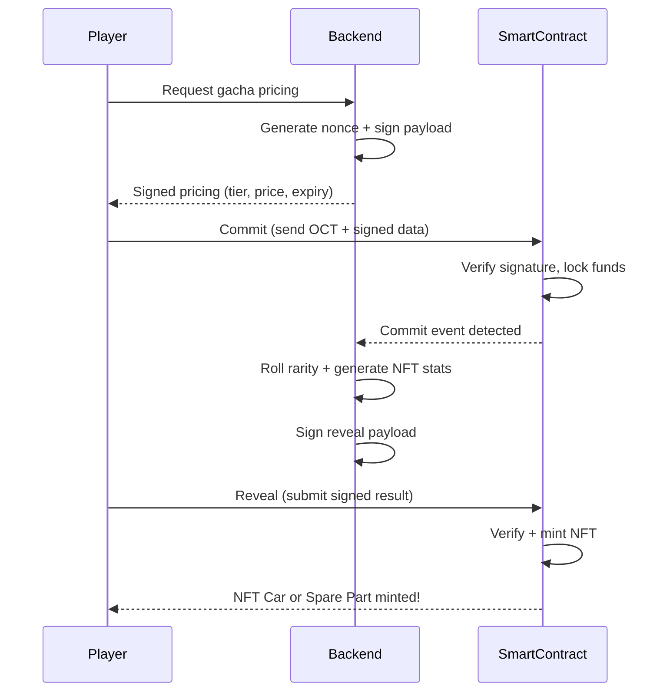

# Gacha System

The gacha system is MiniLabs' primary method for acquiring NFT cars and spare parts. It uses a **commit-reveal pattern** to ensure cryptographic fairness.

## Gacha Tiers

| Tier | Price (OCT) | Legendary Odds | Epic Odds | Rare Odds | Common Odds |
|------|-------------|---------------|-----------|-----------|-------------|
| Economy | 1,000,000 | 1% | 5% | 20% | 74% |
| Sport | 5,000,000 | 3% | 12% | 30% | 55% |
| Hypercar | 10,000,000 | 8% | 22% | 35% | 35% |

> Higher tiers cost more OCT but significantly increase your chances of getting rare and legendary drops.

## How It Works

The gacha uses a **commit-reveal** mechanism to prevent manipulation:

### Step 1 — Commit

The player commits OCT tokens along with a backend-signed pricing payload. The smart contract verifies the backend signature and locks the funds.

### Step 2 — Reveal

After the commit is confirmed on-chain, the backend rolls the randomness (rarity, stats, brand) and signs a reveal payload. The player submits this to the smart contract, which mints the resulting NFT.

## Why Commit-Reveal?

* **Server can't cheat** — the commit locks the player's intent before the result is known
* **Player can't cheat** — the result is determined by the backend after commitment
* **Verifiable on-chain** — every step is recorded and auditable
* **No front-running** — the two-step process prevents MEV-style attacks

## Result Types

Each gacha pull results in either:

* **Car** — A complete NFT car with random brand, rarity, and stats
* **Spare Part** — An equipment NFT with random type, brand compatibility, and bonus stats
