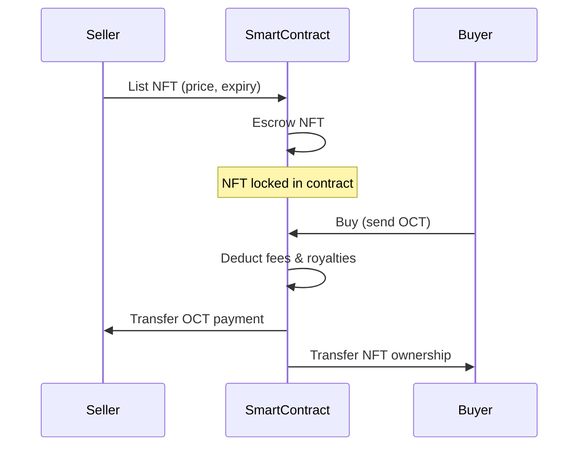

# Marketplace

The MiniLabs Marketplace is a fully on-chain peer-to-peer trading platform for NFT cars and spare parts.

## How It Works

## Listing an NFT

1. Select a car or spare part from your inventory
2. Set your price in OCT tokens
3. Set an expiry date for the listing
4. Confirm the transaction — the NFT is escrowed in the smart contract

## Buying an NFT

1. Browse available listings on the marketplace
2. Filter by type (Car / Spare Part), rarity, brand, and price
3. Click **Buy** and confirm the OCT payment
4. The NFT is transferred to your wallet instantly

## Cancelling a Listing

Sellers can cancel their listing at any time before it's sold. The escrowed NFT is returned to the seller's wallet.

## Fee Structure

| Fee Type | Rate | Recipient |
|----------|------|-----------|
| Marketplace Fee | 2.5% | Platform Treasury |
| Royalty Fee | 2.5% | Original Creator |

> Fees are calculated in basis points (250 bps = 2.5%) and deducted automatically during the buy transaction.

## What Can Be Traded?

| Asset | Attributes Shown |
|-------|-----------------|
| **Cars** | Brand, Rarity, Stats, Equipment Slots |
| **Spare Parts** | Type, Compatible Brand, Bonus Stats |

All listings show full NFT metadata so buyers can make informed decisions.
