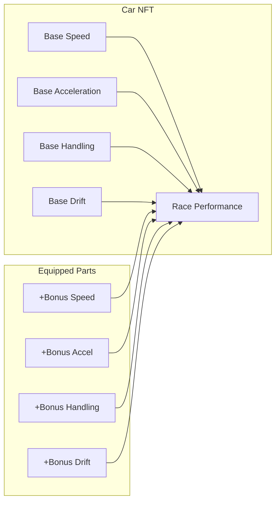

# NFT Cars & Spare Parts

## Cars

Every car in MiniGarage is a unique NFT on OneChain with performance stats that directly affect racing.

### Brands

| ID | Brand | Style |
|----|-------|-------|
| 0 | Lamborghini | Speed-focused |
| 1 | Ferrari | Balanced performance |
| 2 | Ford | Handling specialist |
| 3 | Chevrolet | Drift-oriented |

### Rarity Tiers

| Rarity | Slot Limit | Stat Range | Drop Rate |
|--------|-----------|------------|-----------|
| Common | 2 slots | Low | High |
| Rare | 3 slots | Medium | Medium |
| Epic | 3 slots | High | Low |
| Legendary | 4 slots | Very High | Very Low |

### Performance Stats

Each car has 4 base stats that influence race performance:

* **Speed** — Maximum velocity in races
* **Acceleration** — How quickly the car reaches top speed
* **Handling** — Lane change responsiveness and cornering
* **Drift** — Drift efficiency and control

---

## Spare Parts

Spare parts are NFT equipment items that boost car stats.

### Part Types

| ID | Type | Affects |
|----|------|---------|
| 0 | Wheels | Handling + Drift |
| 1 | Engine | Speed + Acceleration |
| 2 | Body | Speed + Handling |
| 3 | Shocks | Drift + Acceleration |

### Brand Compatibility

Each spare part is designed for a specific car brand. You can only equip parts that match your car's brand — a Ferrari engine won't fit a Lamborghini.

### Equipment Slots

Cars have limited equipment slots based on rarity:

* **Common** — 2 spare part slots
* **Rare** — 3 spare part slots
* **Epic** — 3 spare part slots
* **Legendary** — 4 spare part slots

> Strategically equipping the right parts for your racing style can make a Common car outperform a poorly-equipped Rare.
