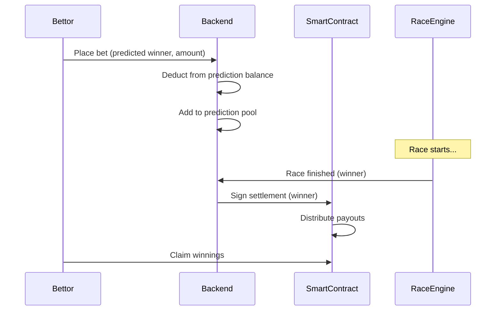

# Prediction Market

MiniLabs features a pool-based prediction market where players can bet on race outcomes using OCT tokens.

## How It Works



## Placing a Bet

1. Navigate to an upcoming race room
2. View the participating players and their cars
3. Select the player you predict will win
4. Enter your bet amount in OCT
5. Confirm — your prediction balance is deducted

## Prediction Pool

Each race room has a **prediction pool** that aggregates all bets:

| Field | Description |
|-------|-------------|
| Total Pool | Sum of all bets placed |
| Bettors | List of all predictions |
| Betting Deadline | Bets close before race starts |
| Settled | Whether the race has been resolved |

## Payout Calculation

Winners receive a **proportional share** of the total pool:

```
Your Payout = (Your Bet / Total Bets on Winner) × Total Pool
```

**Example:**
* Total pool: 1,000 OCT
* Total bets on the winner: 400 OCT
* Your bet on the winner: 100 OCT
* Your payout: (100 / 400) × 1,000 = **250 OCT**

## Deposit & Withdraw

Players maintain a **prediction balance** separate from their wallet:

* **Deposit** — Transfer OCT from wallet to prediction balance (on-chain tx)
* **Withdraw** — Transfer OCT from prediction balance back to wallet
* **Anti-double-credit** — Each deposit transaction is tracked by `txDigest` to prevent replay

## Settlement

After a race finishes:
1. The backend signs the result with the actual winner
2. The smart contract verifies the signature
3. Winning bettors can claim their proportional payout
4. Unclaimed payouts remain available indefinitely
