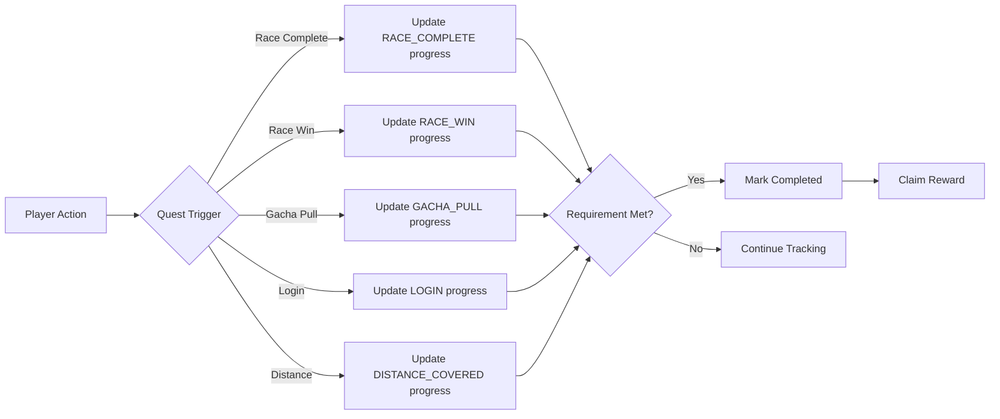

# Quest System

MiniLabs has an automated quest system that rewards players for daily and weekly engagement.

## Quest Types

| Type | Reset | Examples |
|------|-------|---------|
| **Daily** | Every 24 hours | Log in, Complete 3 races, Pull 1 gacha |
| **Weekly** | Every 7 days | Win 5 races, Cover 10,000m distance |

## Available Quests

| Quest | Requirement | Reward |
|-------|------------|--------|
| Daily Check-in | Log in today | 50 tokens |
| Race Warrior | Complete 3 races | 100 tokens |
| Speed Demon | Win 1 race | 150 tokens |
| Lucky Pull | Pull 1 gacha | 75 tokens |
| Road Runner | Cover 5,000m total distance | 200 tokens |

## How Tracking Works

Quest progress is tracked **automatically** — no manual claiming required for progress:

### Tracked Actions

| Action | Trigger Point |
|--------|--------------|
| Login | Wallet authentication (`/api/auth/connect`) |
| Race Complete | Race finish (2D and 3D modes) |
| Race Win | First place finish |
| Gacha Pull | Successful gacha pull |
| Distance Covered | Meters traveled in Endless Race mode |

## Claiming Rewards

Once a quest is completed:
1. Visit the **Quests** page
2. Completed quests show a **Claim** button
3. Tap to receive your token reward
4. Tokens are added to your account balance

> Quests reset automatically — daily quests at midnight UTC, weekly quests on Monday midnight UTC.
