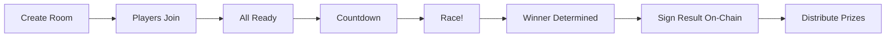
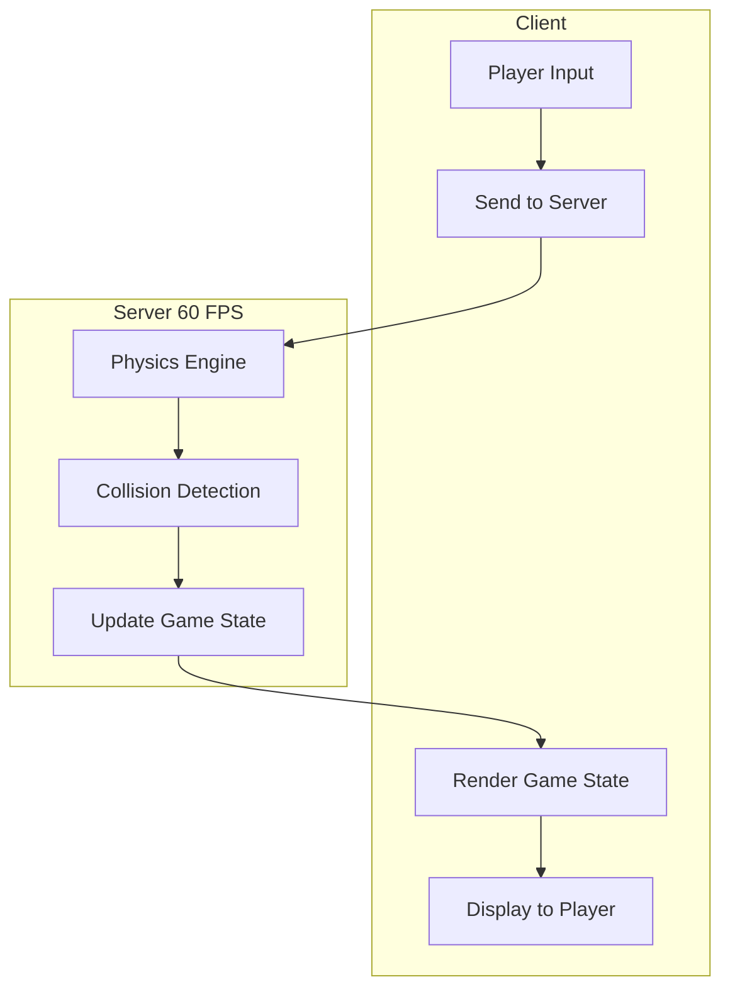

# Racing Game

MiniLabs features three distinct racing modes, each with unique mechanics and objectives.

## Game Modes

### Drag Race (2D)

A classic sprint race built with **Phaser 3**.

* **Players**: 2-8 per room
* **Objective**: First to cross the finish line wins
* **Controls**: Arrow keys for lane changes
* **Scoring**: Finish position determines prize distribution
* **State Sync**: HTTP polling at 100ms intervals

### Endless Race (3D Singleplayer)

A survival-style endless runner built with **Three.js**.

* **Players**: Solo
* **Objective**: Survive as long as possible, maximize score
* **Controls**: Arrow keys (3 lanes), dodge obstacles, collect power-ups
* **Scoring**: Distance + speed + obstacles dodged
* **Leaderboard**: Global rankings by score

| Element | Effect |
|---------|--------|
| Obstacles | Hit = lose HP, game over at 0 |
| Speed Boost | Temporary speed increase |
| Shield | Absorb one obstacle hit |
| Score Multiplier | Double points for limited time |

### Multiplayer Battle (3D)

Real-time competitive racing via **WebSocket**.

* **Players**: 2-8 per room
* **Objective**: Outrace opponents in a shared 3D environment
* **Controls**: Arrow keys for steering and lane changes
* **State Sync**: WebSocket with server-authoritative physics

---

## Server-Authoritative Engine

All game modes use a **server-authoritative architecture** to prevent cheating:

* **Physics runs server-side** at 60 FPS tick rate
* **Clients only send input** (lane change, accelerate)
* **Server broadcasts state** — positions, collisions, power-ups
* **No client-side simulation** — what the server says is truth

## Car Stats in Racing

Your car's NFT stats directly affect race performance:

| Stat | Effect in Race |
|------|---------------|
| Speed | Maximum velocity |
| Acceleration | Time to reach top speed |
| Handling | Lane change speed and responsiveness |
| Drift | Drift efficiency and cornering grip |

> Equipping spare parts that complement your racing style gives a competitive advantage. A high-Speed car with an Engine part becomes nearly unbeatable in straight-line drag races.
