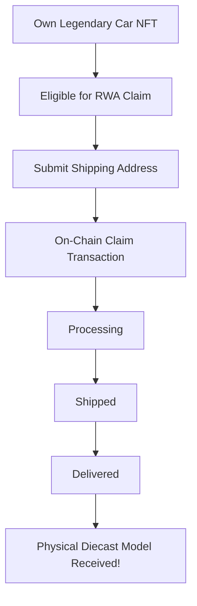

# Real-World Assets (RWA)

MiniGarage bridges digital and physical ownership — legendary NFT cars can be redeemed for **real diecast model cars**.

## How It Works

## Eligibility

To claim a physical car, you must:

1. **Own a Legendary rarity car** — only legendary cars are eligible
2. **Have all spare part slots filled** — the car must have 4 equipped parts
3. **Not have claimed before** — each car can only be claimed once

## Claim Process

### Step 1 — Check Eligibility
Visit the **Claim** page to see your eligible legendary cars.

### Step 2 — Submit Shipping Info
Enter your full shipping address including:
* Full name
* Phone number
* Street address, city, country, postal code

### Step 3 — Confirm On-Chain
The claim is recorded on-chain via a signed transaction. Your NFT car is marked as **claimed** and can no longer be traded.

### Step 4 — Track Delivery
Your claim goes through the following statuses:

| Status | Description |
|--------|-------------|
| **Pending** | Claim received, awaiting processing |
| **Processing** | Order being prepared |
| **Shipped** | Package dispatched, tracking number assigned |
| **Delivered** | Package confirmed delivered |

## What You Receive

* A high-quality **diecast model car** matching your NFT
* The physical model includes the car's name and brand
* Equipped spare parts are included as miniature accessories

> The NFT remains in your wallet after claiming — you still own the digital asset, but it's marked as "claimed" and removed from marketplace trading.
