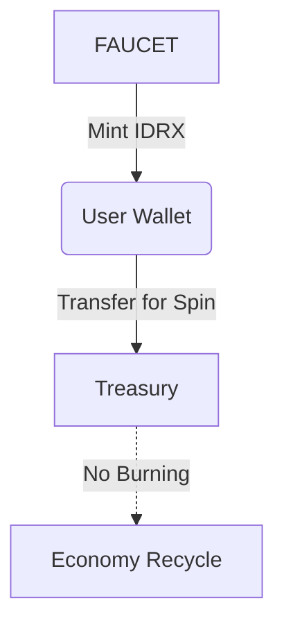

# 💰 IDRX Integration (Testnet)

How MiniGarage uses **MockIDRXv2** as a gasless in-game currency on Base Sepolia.

---

## 🇮🇩 Why Use IDRX?

**Rupiah-Native UX for Indonesian Users**

### Indonesia Context
*   **275M population**
*   Mobile-first users
*   Strong collector & car culture
*   Familiar with Rupiah-style pricing

### UX Advantages
*   **25,000 IDRX** is easier to understand than `0.00001 ETH`
*   **Stable in-game value** (no volatility)
*   **Familiar mental model** for pricing
*   Strong local branding

> **🎯 Design Goal:** Hide crypto complexity, keep ownership on-chain.

---

## 🧪 Current Implementation (Testnet)

### Token Info

<table data-card-size="large" data-view="cards">
<thead><tr><th></th><th></th></tr></thead>
<tbody>
<tr>
<td><strong>Name</strong></td>
<td>Mock IDRX v2</td>
</tr>
<tr>
<td><strong>Symbol</strong></td>
<td>IDRX</td>
</tr>
<tr>
<td><strong>Standard</strong></td>
<td>ERC-20</td>
</tr>
<tr>
<td><strong>Decimals</strong></td>
<td>2 (Rupiah-style)</td>
</tr>
<tr>
<td><strong>Network</strong></td>
<td>Base Sepolia (Chain ID: 84532)</td>
</tr>
<tr>
<td><strong>Supply</strong></td>
<td>Dynamic (minted via faucet & admin)</td>
</tr>
</tbody>
</table>


**Important:** This token is testnet-only and has **no real monetary value**.


---

## 🧠 Core Design: Gasless IDRX Payments

MiniGarage uses a **server-relay model** to remove gas friction:

1.  **Users never pay gas**
2.  Server wallet executes transactions
3.  Users only pay IDRX
4.  Fully on-chain balance & ownership

### 🎯 Features Using IDRX

| Feature | Flow | Type |
| :--- | :--- | :--- |
| **Faucet** | Contract → User | Mint |
| **Gacha Spin** | User → Treasury | Transfer |
| **Fragment Crafting** | Free | — |
| **NFT Mint** | Free | — |
| **Marketplace** (future) | User ↔ User | Transfer |

### 💸 IDRX Economy Flow



*   No burning during spin
*   Treasury-based economy
*   Fully traceable on-chain

---

## 🛠️ Technical Implementation

### Faucet Flow (On-Chain)

```solidity
function claimFaucet() external {
    require(
        block.timestamp >= lastFaucetClaim[msg.sender] + 1 days,
        "Cooldown active"
    );
    _mint(msg.sender, FAUCET_AMOUNT);
}
```

*   **500,000 IDRX** per claim
*   **24h cooldown**
*   Fully on-chain enforcement

### Gasless Gacha Payment (Core Innovation)

**Flow Overview:**
1.  User approves server wallet **once**.
2.  User clicks "Spin".
3.  **Backend pays gas**.
4.  Contract transfers IDRX from **User → Treasury**.

**Server-Relayed Payment (Contract Logic):**

```solidity
function payForSpinOnBehalfOf(
    address user,
    uint256 spinCost
) external onlyServer {
    _spendAllowance(user, serverWallet, spinCost);
    _transfer(user, treasuryWallet, spinCost);
}
```

**Key Properties:**
*   **Server wallet** = gas payer
*   **User wallet** = token payer
*   Secure via allowance
*   No ETH required for user

**Frontend Flow:**

```javascript
// One-time approval
await idrx.approve(serverWallet, spinCost);

// Request spin
await fetch("/api/gacha/spin", {
  method: "POST",
});
```

---

## 📊 IDRX Statistics (Testnet Snapshot)

| Metric | Value |
| :--- | :--- |
| **Total Minted** | Dynamic |
| **Total Burned** | Optional (manual burn) |
| **Active Wallets** | 100+ |
| **Avg Balance** | ~500,000 IDRX |

---

## 🧠 Pricing Model (Decimals = 2)

### Gacha Pricing

<table data-card-size="large" data-view="cards">
<thead><tr><th></th><th></th></tr></thead>
<tbody>
<tr>
<td><strong>Standard</strong></td>
<td>25,000 IDRX</td>
</tr>
<tr>
<td><strong>Rare</strong></td>
<td>30,000 IDRX</td>
</tr>
<tr>
<td><strong>Premium</strong></td>
<td>35,000 IDRX</td>
</tr>
<tr>
<td><strong>Legendary</strong></td>
<td>50,000 IDRX</td>
</tr>
</tbody>
</table>

> 💡 **Mental Model:** `25,000 IDRX` = `Rp 25.000`

### Faucet Amount

**500,000 IDRX** — Enough for:
*   20 Standard spins
*   16 Rare spins
*   14 Premium spins
*   10 Legendary spins

> **Psychological effect:** “I can try the game freely without paying anything.”

---

## 🔐 Security Considerations

### Minting & Relay Control

| Role | Capability |
| :--- | :--- |
| **Owner** | Mint, update server/treasury |
| **Server Wallet** | Relay gasless payments |
| **User** | Approve & spend IDRX |

### Approval Best Practices

```javascript
// ✅ Recommended
await idrx.approve(serverWallet, exactAmount);

// ❌ Avoid
await idrx.approve(serverWallet, MaxUint256);
```

---

## 🚀 Mainnet Strategy (Future)

*   **Option 1 — Stablecoin Backend:** Use USDC/USDT, display in IDR, convert internally.
*   **Option 2 — Custom IDRX:** Treasury-backed, redeemable rewards, loyalty utility.
*   **Option 3 — Hybrid:** IDRX for gameplay, Stablecoin for marketplace.

---

## 🧪 Developer Testing

**1. Get Base Sepolia ETH**
[https://faucet.base.org](https://faucet.base.org)

**2. Check Balance**
```javascript
const balance = await idrx.balanceOf(user);
console.log(balance.toString());
```

---

## ✅ Summary

**MockIDRXv2 enables:**
*   🇮🇩 **Indonesia-first UX**
*   ⚡ **Gasless gameplay**
*   🔐 **On-chain ownership**
*   🧠 **Simple mental model**
*   🚀 **Scalable to mainnet**

> Crypto complexity is hidden — value and ownership remain on-chain.